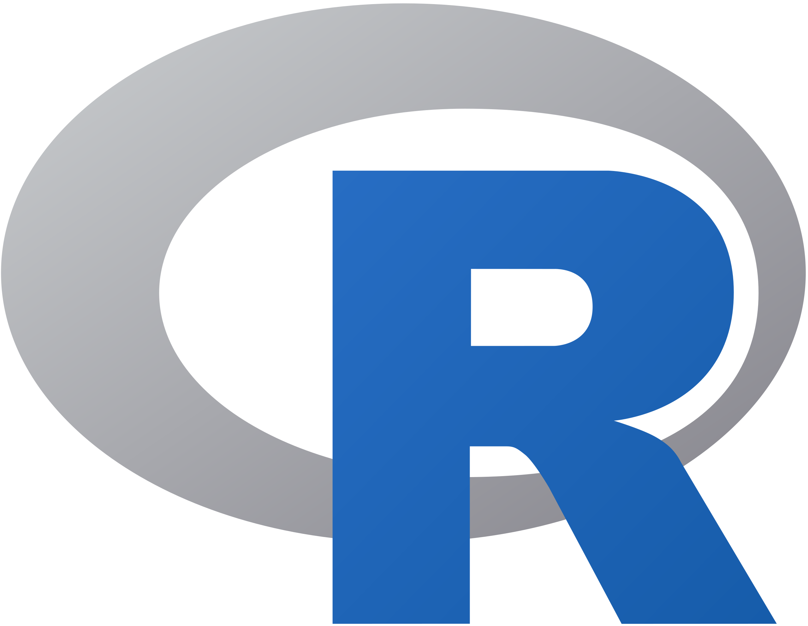

# Hey 👋🏻, I'm Rushabh Kela

I am a versatilist and a full - stack developer, having made some really cool projects using NodeJS, Express Framework and Bootstrap (Have a look at them in the repository section and feel free to contribute with your ideas! 💡). I love exploring new tech stack 💻 and leveraging them to build cool stuffs 🛠️. 
 
 

 
 
 
 

  
## 🧐 More About Me:

- 🔭 &nbsp; I’m currently thinking of a new idea to work on.
- 🤝 &nbsp; Would love to integrate new ideas into [VITdost](https://github.com/rushabhkela/vitdost) 
- 🌱 &nbsp; I’m currently learning Typescript; 
- 👨🏻‍💻 &nbsp; Most of my projects are available on [Github](https://github.com/rushabhkela?tab=repositories)
- 🎨 &nbsp; I have also worked with R for Data Science, and quite good in Data  &nbsp;&nbsp;&nbsp;&nbsp;&nbsp;&nbsp;&nbsp;Visualisation, Data Processing and EDA using R.
- 💬 &nbsp; Ask me about anything tech related, I am happy to help;
- 📫 &nbsp; Feel free to ping me on [LinkedIn](https://www.linkedin.com/in/rushabhkela/)
- 📝 &nbsp; Checkout my [resume](https://drive.google.com/file/d/1UPBEwo17rkvw5sVLLleRydUOejSLa8fp/view?usp=sharing)
- 🖥 &nbsp; [My Portfolio](https://rushabh-kela.herokuapp.com)
- ⏳ &nbsp; Feel free to mail me, in case of any queries related to my projects.

 

## 🔨 Languages and Tools:

 
 
 
 
 

## 📊 Github Stats

## 🛠️ My Projects

 

 
 

 

I am looking forward to absorb knowledge 🧠, gain experience ğŸ­, collaborate 🤠and build amazing products for the world ğŸŒ!

 
 

 
  Visitors count 
  

